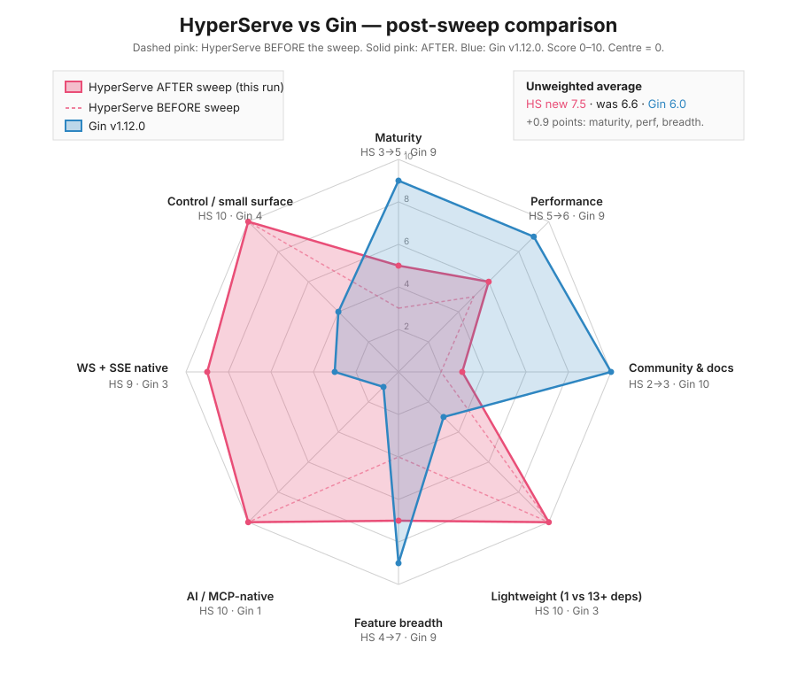

# HyperServe vs Gin: a smaller net/http wrapper that speaks MCP



Stand up an MCP server in Go today and you have two choices: run a separate process and route between it and your HTTP service, or write the JSON-RPC handshake yourself. Both work. Neither is the same thing as `srv.HandleFunc` plus a couple of registered tools sharing one process and one config tree, which is what HyperServe is built around.

The comparison here is with Gin because Gin is the framework anyone evaluating HyperServe is also evaluating. The reasons to pick Gin are real and unchanged. HyperServe is not a Gin replacement; it's a different bet about what 2026 needs from a Go HTTP framework.

## The 30-second tour

Install:

```bash
go get github.com/osauer/hyperserve/pkg/server
```

The hello world is the same shape every Go HTTP library has:

```go
package main

import (
    "fmt"
    "net/http"

    server "github.com/osauer/hyperserve/pkg/server"
)

func main() {
    srv, _ := server.NewServer()
    srv.HandleFunc("/", func(w http.ResponseWriter, r *http.Request) {
        fmt.Fprintln(w, "Hello, World!")
    })
    srv.Run()
}
```

The handler signature is the stdlib one. That is on purpose. Nothing wrapped, nothing you need to learn that you wouldn't pick up from the `net/http` docs. The framework gives you middleware, grouping, graceful shutdown, and metrics; the handler itself stays `func(http.ResponseWriter, *http.Request)`.

For typed JSON endpoints there are two generic helpers and the lower-level binding primitives. The shortest endpoint is one line:

```go
type Event struct {
    Type    string `json:"type"    validate:"required,oneof=ping pong"`
    Payload string `json:"payload" validate:"required,max=4096"`
}

srv.POST("/webhook", server.JSONEcho[Event]())
```

`JSONEcho[T]` binds the body, runs the `validate:` rules, and writes the validated value back as 200. It's the right tool for webhook acks, validation-only endpoints, and any case where the response shape is the same as the input. No handler function needed.

When the response is different from the input (an assigned ID, a normalized email, a database lookup), `JSONHandler[In, Out]` is the wrapper:

```go
type CreateUser struct {
    Name  string `json:"name"  validate:"required,min=2,max=64"`
    Email string `json:"email" validate:"required,email"`
    Age   int    `json:"age"   validate:"required,min=13,max=120"`
    Role  string `json:"role"  validate:"required,oneof=admin user guest"`
}

type User struct {
    ID    string `json:"id"`
    Name  string `json:"name"`
    Email string `json:"email"`
    Age   int    `json:"age"`
    Role  string `json:"role"`
}

func createUser(ctx context.Context, in CreateUser) (User, error) {
    return User{
        ID:    newID(),
        Name:  in.Name,
        Email: strings.ToLower(in.Email),
        Age:   in.Age,
        Role:  in.Role,
    }, nil
}

srv.POST("/users", server.JSONHandler(createUser))
```

`JSONHandler` calls `BindJSON`, runs validation, invokes your function with `r.Context()`, then writes a JSON 200 (or 204 if `Out` is empty). On a `*server.ValidationError` it writes a per-field 400; on an error implementing `HTTPStatus() int` (`server.StatusError` is the bundled convenience) it writes that status. Everything else gets a generic 500 with the original error left in the server log, not the client response.

`srv.POST` and its siblings (`GET`, `PUT`, `PATCH`, `DELETE`, `HEAD`, `OPTIONS`) are thin wrappers over the Go 1.22+ ServeMux. Wrong-method requests get a 405 with the right `Allow` header automatically, so the handler never has to switch on `r.Method`.

The verb set on the `validate:` tag is deliberately small: `required, min, max, len, email, url, oneof`. The implementation is in [pkg/server/binding.go](pkg/server/binding.go) plus [pkg/server/typed_handler.go](pkg/server/typed_handler.go): around 600 lines of reflection, no codegen, no `validator/v10`. The lower-level `BindJSON` / `BindQuery` / `BindForm` / `Validate` entry points are still there for handlers that need to set custom headers, stream a response, or use a non-JSON envelope. `JSONHandler` and `JSONEcho` are shortcuts, not replacements.

That's most of what you need to write an endpoint.

## What about just `net/http`?

A fair question, especially in 2026. The stdlib has caught up with most of what people used to reach for a framework for.

Go 1.22 turned `net/http.ServeMux` into a real router. You can write `mux.HandleFunc("POST /users/{id}", ...)` and pull the path parameter with `r.PathValue("id")`. Method-aware routing, host-aware routing, and prefix patterns all work without a library. Go 1.21 shipped `log/slog`, so structured logging is in the standard library. Graceful shutdown is `srv.Shutdown(ctx)` plus a signal handler. With Go 1.26, a full CRUD service in ~150 lines using only the standard library is realistic.

Here is what the stdlib still won't do for you:

- **Request binding and validation.** You write the JSON decode, the field checks, and the 400 response formatting by hand for every endpoint. After three handlers, you have re-implemented a worse `validator/v10`.
- **WebSocket and SSE.** No WebSocket in the standard library. SSE is hand-rollable but you'll get the reconnection, the heartbeat, and the buffering wrong the first time.
- **Middleware composition.** `net/http` gives you `func(http.Handler) http.Handler` and that's it. Chaining, per-route stacks, ordered application: you write it.
- **Rate limiting, CORS, security headers, request logging.** Each is an afternoon, but they are four afternoons, and the result will not be a coherent stack.
- **MCP.** No stdlib path. The protocol is JSON-RPC over HTTP/SSE/stdio with a specific handshake; you need a library or your own implementation.

So the honest answer is: the standard library now handles routing, structured logging, and lifecycle. A framework earns its space on what is left, which is binding, the streaming protocols, the middleware bundle, and (for HyperServe specifically) the MCP plumbing. If you don't need any of that, you don't need this library or Gin. If you need one or two of them, weigh whether a focused dependency beats four small ones. If you need most of them, framework territory is where you already are.

## Where HyperServe earns its space

**MCP in the same process.** This is the actual reason the library exists. The Model Context Protocol is the standard AI assistants use to discover and call tools: `tools/list`, `tools/call`, `resources/list`, the JSON-RPC shapes Anthropic published. HyperServe ships a server-side MCP implementation as a library, with HTTP, SSE, and stdio transports, discovery endpoints, and namespace routing. Tool registration is typed:

```go
type SearchArgs struct {
    Query string `json:"query" validate:"required,min=1,max=200" mcp:"desc=Search query"`
    Limit int    `json:"limit" validate:"min=1,max=100"`
}

srv, _ := server.NewServer(server.WithMCPSupport("MyServer", "1.0.0"))
srv.RegisterMCPTool(mcp.NewTypedTool("search", "Search the corpus.", search))
// search: func(ctx context.Context, args SearchArgs) (Results, error)
```

`mcp.NewTypedTool[In, Out]` derives the `inputSchema` and `outputSchema` (the latter added by the 2025-06-18 MCP spec revision) from struct tags via reflection, runs the same `validate:` rules `BindJSON` uses, then calls your function with a fully-typed args struct. No `map[string]any`, no `params["x"].(string)` assertions, no schema-and-implementation drift.

If you have ever tried to bolt MCP onto an existing Go service, you know the alternative: a separate process, routing between them, two sets of lifecycle hooks. HyperServe collapses that into one binary. The protocol code is in [pkg/mcp/handler.go](pkg/mcp/handler.go) (673 lines) plus a handful of transport files. You can read the whole thing in an hour. This is the bet the library is making. Everything else is here so you don't have to glue four small libraries together to use it.

**Native WebSocket and SSE.** RFC 6455 WebSocket and Server-Sent Events live in `pkg/websocket` and `pkg/mcp/sse`. No `gorilla/websocket`, no `r3labs/sse`. The SSE work is what unlocks the MCP SSE transport; they share the connection management code.

**Typed handlers, top to bottom.** A typed JSON endpoint is one function and one route line. Echo-only endpoints are zero functions and one route line. MCP tools work the same way: one typed function, one `NewTypedTool` line, schemas derived from the same struct tags. The wrapper code reuses one validator across HTTP binding, MCP tool dispatch, and the `Validate` standalone path. A typical CRUD endpoint here is shorter than the same endpoint in Gin, and an MCP tool here is significantly shorter than the older `WithParameter` builder shape.

**One runtime dependency.** `golang.org/x/time` for the rate limiter, and that's it. Vendoring is a five-second operation. The `go.sum` is short enough to actually read. There's a `tool` directive in `go.mod` pulling `golang.org/x/tools` for the modernize check, but those are build-time only and don't ship in your binary. If you have ever had to audit a transitive dependency tree for a security review, this matters. If you have not, it is a curiosity.

**A small code base.** 99 Go files, mostly small. You can read the whole framework in an afternoon. That isn't a feature for everyone. Most production services don't need their framework to be auditable in one sitting. But if you're the kind of person who wants to understand the thing your traffic flows through, this is in reach.

**Security defaults.** The most recent security pass closed seven concrete vulnerability classes in the built-in MCP surface. Worth itemizing:

- The `http_request` built-in tool is gone. It was an SSRF vector: any MCP caller could make outbound requests from the server process, including hitting cloud metadata endpoints. No replacement. If you need that primitive, ship a domain-allowlisted version from your own code.
- The `request_debugger` tool is gone. It stored `r.Header` verbatim (including `Authorization`, `Cookie`, `X-API-Key`) in a process-wide map readable by any MCP caller. Credential exfiltration path, deleted.
- File tools refuse to construct without a sandbox root. The unsandboxed `os.ReadFile` fallback was deleted, not deprecated.
- SSE client IDs are sourced from `crypto/rand` now (previously `math/rand`, whose state can be recovered from observed outputs).
- The SSE-to-HTTP request injection class was closed with a `bindingToken` capability. Every routed POST has to echo the token the client got at connect time; 403 otherwise. Comparison is constant-time.
- CORS refuses `AllowedOrigins=["*"]` with `AllowCredentials=true`, matching the Fetch spec. The combination is downgraded at construction time with a warn-log.

This is the kind of release note worth reading when you're deciding whether to trust a framework.

## Where Gin earns its space

Gin has been in production for nine years. It has been benchmarked, hardened, and stress-tested against workloads HyperServe won't see this decade. Photoprism, fnproject, gorush, and a long tail of services run on it. When you have a question, the answer exists. When you hit a sharp edge, somebody already filed the issue.

Its router is a custom radix tree with zero-allocation matching. That's a real performance edge over HyperServe, which uses `net/http.ServeMux`. For services where routing is on the hot path (high-RPS proxies, low-latency APIs), Gin will outperform. Nobody has published apples-to-apples numbers for HyperServe and I am not going to invent them here, but the design choice is visible. The stdlib router is not built for that workload, and HyperServe inherits its limits.

The ecosystem is the other thing. Gin's `validator/v10` integration handles dozens of validation tags that HyperServe's seven do not (cross-field rules, custom validators, internationalized errors). Its binding supports XML, YAML, MsgPack, ProtoBuf. There's community middleware for every observability vendor in the catalog. If you need any of that off the shelf, HyperServe is going to be DIY.

The dependency count cuts both ways. Gin v1.12.0 pulls in sonic, goccy/go-json, validator/v10, mongo-driver, quic-go, protobuf, and a handful of others: thirteen-plus direct deps, more transitively. That is a lot more code than HyperServe ships, but every one of those libraries is there because someone needed it. "Fewer dependencies" is only better when you're not paying for the things they buy you.

The honest summary: Gin is a mature framework with a real ecosystem. HyperServe is a smaller, opinionated alternative built around one specific bet, MCP-as-a-library, that Gin doesn't make.

## Same handler, both frameworks

Validate a JSON body, return the validated input on success, return a structured error on failure. Both libraries support this path; the line counts are not the same.

**Gin:**

```go
type CreateUser struct {
    Name  string `json:"name"  binding:"required,min=2,max=64"`
    Email string `json:"email" binding:"required,email"`
    Age   int    `json:"age"   binding:"required,min=13,max=120"`
    Role  string `json:"role"  binding:"oneof=admin user guest"`
}

r := gin.Default()
r.POST("/users", func(c *gin.Context) {
    var u CreateUser
    if err := c.ShouldBindJSON(&u); err != nil {
        c.JSON(http.StatusBadRequest, gin.H{"error": err.Error()})
        return
    }
    c.JSON(http.StatusOK, u)
})
r.Run(":8080")
```

**HyperServe:**

```go
type CreateUser struct {
    Name  string `json:"name"  validate:"required,min=2,max=64"`
    Email string `json:"email" validate:"required,email"`
    Age   int    `json:"age"   validate:"required,min=13,max=120"`
    Role  string `json:"role"  validate:"required,oneof=admin user guest"`
}

srv, _ := server.NewServer(server.WithAddr(":8080"))
srv.POST("/users", server.JSONEcho[CreateUser]())
srv.Run()
```

The HyperServe handler is one line. `JSONEcho` does the bind, the validation, the per-field 400 envelope, and the 200 response with the validated body. The Gin equivalent needs a handler function regardless, because there's no idiom for "validate and respond" without an explicit function body.

When the response is genuinely different from the input (an assigned server-side ID, a normalized email), both frameworks need a real function. There, the shapes converge: Gin's `c.ShouldBindJSON` plus manual `c.JSON` is about the same line count as HyperServe's `JSONHandler` plus a typed business function. The difference is where the boilerplate lives. In Gin it's inside every handler. In HyperServe it's hidden inside the wrapper.

The rest of the differences sit further out. Gin's `binding:` tag dispatches to `validator/v10` and supports cross-field rules HyperServe doesn't. Pulling Gin into a fresh module brings in roughly thirty transitive packages. Pulling HyperServe brings in one.

## When to pick which

A few concrete cases.

**You are shipping AI-adjacent infrastructure.** Internal copilots, ops tooling an assistant queries, anything where an MCP client (Claude Desktop, Cursor, an in-house agent) needs to talk to your server. HyperServe is the only Go framework I know of where this is a one-option opt-in rather than a separate process. Pick it.

**You are running a high-RPS service where routing latency shows up in p99.** Pick Gin. The custom router is built for that workload and HyperServe has not made the same investment in its routing layer.

If you need an off-the-shelf feature Gin already has (XML binding, protobuf, swagger generation, observability middleware from your APM vendor), pick Gin. That's a long tail of small libraries you'd otherwise have to port.

For new internal services where the team values a small dependency tree, or where you want to be able to read the framework before you trust it, HyperServe is the more interesting choice. Both arguments lead in the same direction: a smaller, opinionated library is easier to reason about than a sprawling ecosystem, and 12k lines is something a single engineer can read over a weekend.

## What's next

The library is moving. The last several releases added binding and validation, then a typed `JSONHandler`, then method-aware route helpers, then `JSONEcho` for the validate-and-echo case, then typed MCP tool registration with reflection-derived input and output schemas. The HTTP side and the MCP side share one validator and one set of struct tags. Pre-1.0 means the API can still move; version-pin and read the CHANGELOG before upgrading.

What's left is the long tail: more validation verbs (cross-field rules, custom validators), an OpenAPI generator that reuses the same struct tags, and a published benchmark suite against `net/http` and Gin. The library is still pre-1.0 and run by one maintainer, but the core surface has stabilised to the point where the remaining work is filling gaps, not picking a shape.

The `examples/binding`, `examples/mcp-basic`, and `examples/mcp-extensions` directories are the cheap way to find out whether this is the framework you want for the thing you're about to build. They're each a single `go run .` away from running on your machine.
